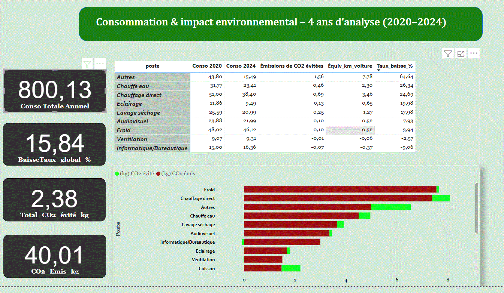

# Impact-energetique-powerbi
Analyse Power BI de la consommation énergétique et de l'impact CO₂ d’un foyer type (2020–2024)
# 🌍 Analyse Power BI – Impact énergétique & environnemental d’un foyer type

Ce projet Power BI vise à analyser la consommation électrique d’un foyer type sur 4 ans (2020–2024), poste par poste, et à quantifier les économies d’énergie ainsi que l’impact environnemental associé.

---

## 🎯 Objectifs

- Identifier les postes les plus énergivores
- Suivre leur évolution dans le temps
- Estimer les émissions de CO₂ évitées
- Traduire les gains en équivalents concrets : arbres plantés, kilomètres voiture évités

---

## 📊 Données & Méthodologie

- **Période analysée** : Juillet 2020 → Juillet 2024
- **Nombre de postes étudiés** : 18 (chauffage, bureautique, audiovisuel, etc.)
- **Source de données** : Data.gouv.fr – échantillon de foyers type
- **Indicateurs produits** :
  - Conso par poste (kWh)
  - Taux de baisse sur 4 ans
  - Équivalents CO₂ (kg), arbres, kilomètres

---

## 📈 Résultats principaux

- Réduction globale : **−15,8 %**
- CO₂ évité : **2,4 kg** (≈ 0,10 arbre)
- Postes en forte baisse :
  - “Autres” : **−64,6 %**
  - Chauffe-eau : **−26,4 %**
  - Chauffage direct : **−24,7 %**
- Postes en hausse :
  - Bureautique : **+9,1 %**
  - Ventilation : **+2,6 %**

---

### 🖼️ Aperçu dynamique

---

## 🌱 Démarche durable & alignement ADEME

Ce projet illustre les **3 leviers recommandés par l’ADEME** pour réussir la transition bas carbone :

1. Réduire ses propres émissions
2. Utiliser ou proposer des solutions bas carbone
3. Contribuer à la séquestration carbone

---

## 📚 Sources

- [Data.gouv.fr](https://www.data.gouv.fr)
- [ADEME – Base Carbone](https://base-empreinte.ademe.fr/)
- [GoodPlanet](https://www.goodplanet.org/)
- [Emission Index](https://www.emission-index.com/greenhouse-gases/reducing-co2-emissions#:~:text=Reducing%20carbon%20dioxide%20and%20other,jobs%20and%20driving%20economic%20growth.)

---

## 🔗 Accès rapide

📎 Dashboard résumé : 📎 [📂 Dashboard.pbit](https://github.com/Data-Projects-Hub/impact-energetique-powerbi/blob/main/Dashboard.pbit)

 

---

